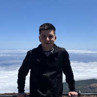
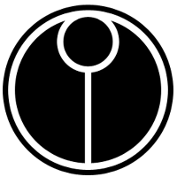

# Description of project

This application is a task and schedule organising tool called "Talio".  It was made in 10 weeks with a team of 6 students as part of the Object Oriented Programming Project course in my university. We have all equally contributed to all feautres of the application(front-end, backend, devops, etc.)

## Group members

| Profile Picture                     | Name | Email |
|-------------------------------------|---|---|
|  | Edward Oh Jang Hun | J.oh-2@student.tudelft.nl |
|  | Wiktor Cupiał | w.m.cupial@student.tudelft.nl |
|  | Eduard Faraon | e.faraon@student.tudelft.nl |
|  | Eduardo Hernández | e.hernandez-melian@student.tudelft.nl |
|   | Bobi Marinov | b.k.marinov-1@student.tudelft.nl |
|                             | Jaouad Hidayat | j.hidayat@student.tudelft.nl |
